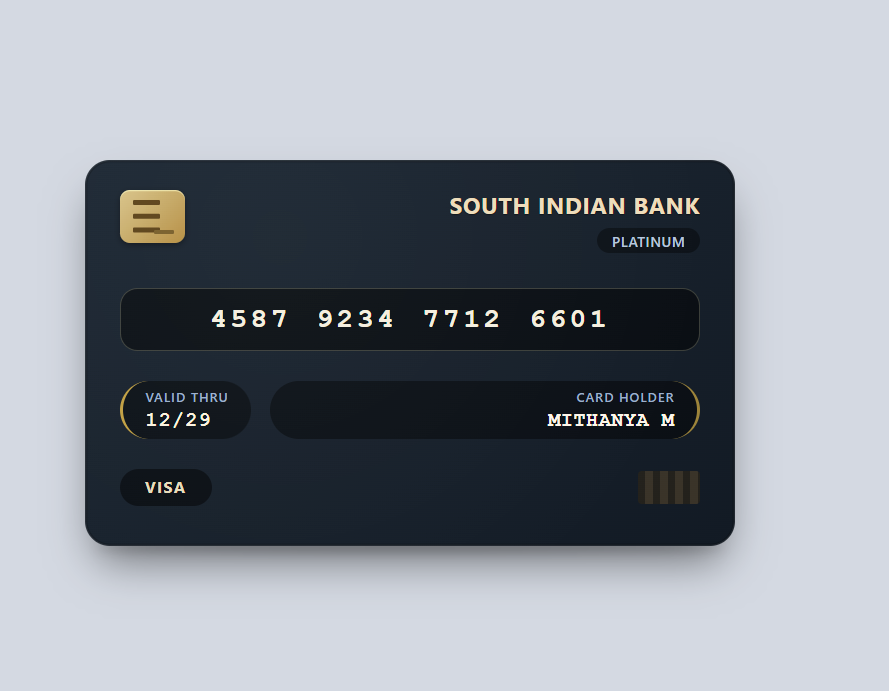

# ATM Card UI Design

This project presents a realistic ATM card user interface developed using HTML and CSS. The design focuses on accurately replicating the visual appearance of a physical debit/credit card through structured layout, refined typography, gradient styling, and shadow effects.

The interface includes key card components such as the chip, card number, expiry date, cardholder name, and network branding. The primary objective of this project is to demonstrate frontend design precision and visual detailing without the use of JavaScript.

## Technologies Used
HTML5  
CSS3 (Flexbox, Gradients, Shadows, Media Queries)

## Features
Realistic card layout and structure  
Clean and consistent typography  
Gradient-based styling for depth and texture  
Subtle shadow effects for physical card appearance  
Responsive design for different screen sizes  
Pure HTML and CSS implementation  

## Preview

## Usage
Clone the repository and open the `index.html` file in any modern web browser to view the project.

## Author
Mithanya Murugesan  

## License
This project is open source and available under the MIT License.
